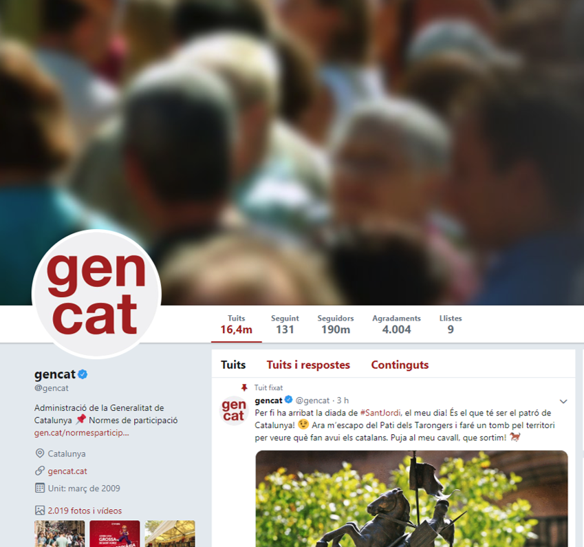
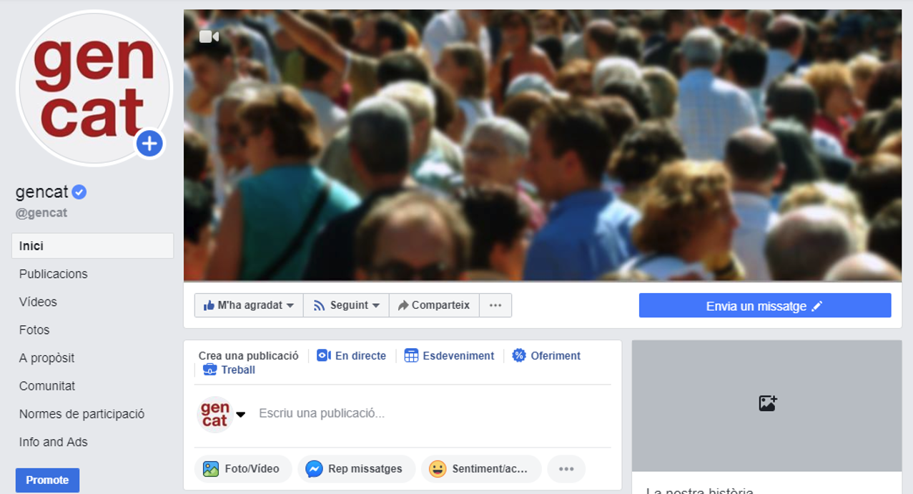
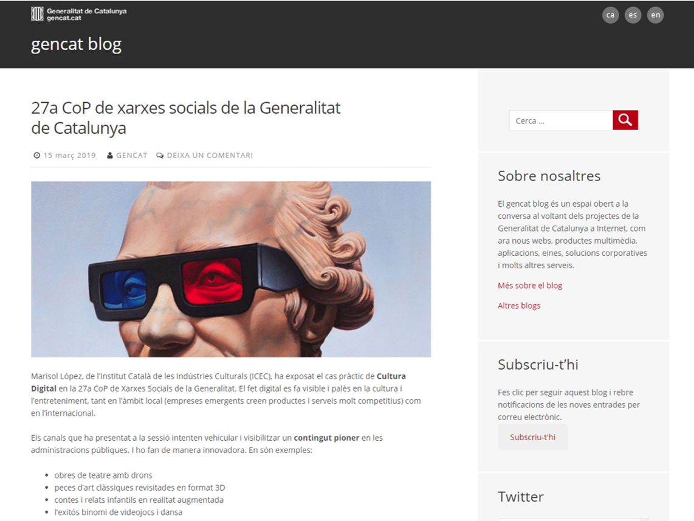
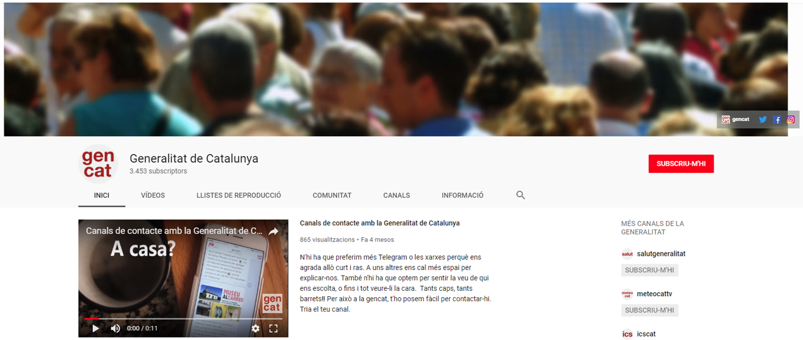

# 4. Eines

Les xarxes socials i els repositoris són eines dinàmiques que ajuden a millorar la relació de l'Administració amb la ciutadania en oferir un servei més proper i directe. En cap cas no s'obriran nous canals en aquests entorns si aquestes eines no col•laboren a la millora del servei. Cada departament, servei o marca té uns objectius i un públic destinatari diferents. Això fa que no totes les eines siguin igual d'idònies per a cada una de les necessitats.

Els perfils corporatius de la Generalitat a les xarxes socials són un actiu públic. La titularitat és de la Generalitat i, per aquesta raó, no hi figura el nom de la persona que té la responsabilitat d'editar els continguts del perfil. Per assegurar la perdurabilitat en el temps, els perfils s'obren a partir de correu electrònics genèrics de gencat. Pel mateix motiu, els editors del perfil publiquen els continguts fent ús d'eines que afegeixen seguretat i professionalitat al procés de gestió.

El *nom d'usuari* en aquestes eines es forma a partir del nom propi de l'àmbit, servei o marca i afengint-hi el sufix **cat**. Per exemple @empresacat per al Departament d'Empresa i Coneixement o @salutcat pel Departament de Salut. Si el nom d'usuari ja es troba en ús, la DGSEC en decidirà un altre de més adient conjuntament amb la unitat responsable.

L'*avatar* dels perfils el facilita la DGSEC seguint les pautes del [Programa d'identificació visual](http://identitatcorporativa.gencat.cat/ca/aplicacions/xarxes-socials/). L'avatar és una aproximació visual ràpida a un canal oficial de la Generalitat i, per això, la ciutadania ha de poder identificar fàcilment que aquell compte és d'un canal oficial. Per als organismes de la Generalitat, l'avatar està compost d'un fons gris i tipografia en vermell corporatiu. En els perfils de Govern i de les delegacions a l'exterior, el fons és blau corporatiu i les lletres en blanc.

Per implementar les pautes d’identitat corporativa la DGSEC defineix els camps següents:

- *Avatar*: el corporatiu seguint el programa d'identificació visual.
- *Nom d'usuari*: nom del servei més el sufix "cat", màxim 15 caràcters.
- *El nom d'usuari* del compte: nom del servei, primera lletra en majúscula.
- *El web de referència*, que ha de ser l'adreça (URL) de comunicació pròpia del departament, servei o marca. Preferiblement s'utilitzen els subdominis *gencat.cat*.  
- La *localització*: Catalunya per als organismes centrals. I la localització específica per a cada organisme extern.  
- Una *descripció breu* per a l’apartat Bio, que ha de constar de [nom del departament, servei o marca. Generalitat de Catalunya] i no ha de tenir més de 160 caràcters. Si no s’ha arribat al límit total de caràcters, cal posar el nom del departament, servei o marca també en anglès.  Si s'escau també informarem de l'horari d'atenció del canal.

## 4.1 Twitter

### 4.1.1. Descripció

Twitter és una plataforma de micromissatgeria per publicar missatges de text curts (fins a 140 caràcters) i conversar amb els altres usuaris per mitjà de navegadors web o aplicacions mòbils. La conversa és habitualment oberta, encara que es poden protegir les converses d'un compte perquè només les puguin veure els seus seguidors, i s’hi construeixen relacions a partir del seguiment dels usuaris que interessi.

És una eina idònia per informar de nous serveis, referenciar informacions diverses (d’agenda, emergències, noves publicacions...) i  retransmetre esdeveniments. Però també és una eina per dialogar i col•laborar. En aquest sentit, els perfils de Twitter de la Generalitat de Catalunya han d’afavorir la conversa i interaccionar amb els usuaris.

### 4.1.2. Gestió dels comptes

Els comptes es gestionen des de l’aplicació Hootsuite, a què s'accedeix amb el perfil personal de Twitter de cada editor. La DGSEC obre els comptes de Twiter i designa un usuari que administra els editors del perfil. Aquest administrador és l'encarregat de donar permisos d'edició a les persones que gestionen el compte. 

En els dispositius mòbils es gestionen les publicacions des de l’aplicació oficial de Twitter aprofitant l’opció multicompte. La DGSEC és l’encarregada de configurar-ne l’accés en el dispositiu mòbil a les persones editores dels comptes.

### 4.1.3. Aspectes de presentació

- **Colors de disseny**. El fons ha de ser blanc (#FFFFFF) per a tots els perfils. El color de marca és el vermell corporatiu (#AC2115) a excepció dels perfils de Govern que utilitzen el blau corporatiu (#0B66AC).
- **Imatge de capçalera**. Twitter es pot personalitzar el perfil amb una capçalera de 1500 x 500 px visible des del perfil. Cada departament, servei o marca pot triar la imatge de capçalera per al seu perfil d’acord amb la seva normativa gràfica. Es recomana que aquesta imatge sigui conceptual, relacionada amb l’àmbit d’actuació i sense missatges publicitaris. Quan es vol canviar la imatge, cal enviar-la per correu a la DGSEC (xarxes@gencat.cat), especificant el nom del compte de Twittter a l’assumpte. Es recomana provar la imatge en un perfil personal abans d’enviar-la per estar segurs de quina es vol escollir.
- **Tuit destacat**. Twitter ofereix la possibilitat de destacar continguts al capdamunt del perfil amb l’opció Fixa’l al teu perfil.

### 4.1.4. Continguts

#### Usos lingüístics

Els tuits es redacten majoritàriament en català, la llengua comuna i pròpia. També se'n poden redactar en castellà i en anglès, segons el tipus de continguts de què es tracti.

Pel que fa als retuits, es respectarà la llengua en què han estat escrits originàriament.

#### Estructura del tuit

Els tuits es componen d’un text (a mode de titular), preferentment d’un enllaç escurçat, quan sigui adient, d’una etiqueta introduïda pel símbol # i, sempre que sigui possible, d'una imatge.

	**Text + enllaç escurçat + #etiqueta + imatge**

	 Captura tuit amb imatge
	//Anàlisi de comptes Twitter del Parlament de Catalunya bit.ly/cLcOR4 #ogov

Pel que fa al text, cal que la informació sigui sintètica, rigorosa i concisa. Per això, és important adjuntar-hi un enllaç si escau, ja que, d’aquesta manera, s’ofereix als usuaris la possibilitat d’ampliar el contingut.

En el cas de retransmissió d’actes en directe (*live blogging*) a través de Twitter, no és necessari que hi hagi associat cap enllaç, però és important sempre acompanyar el tuit de l’etiqueta que faci referència a l’acte.

	**Autor + Cita + #etiqueta**
	 Captura tuit amb imatge
	//Boris Mir: Les competències transversals són importants en el nou sistema educatiu #sessioweb

Si s’ha de retransmetre un esdeveniment en directe amb regularitat, es recomana crear un canal especial (per exemple, [@sessionsweb](http://twitter.com/sessionsweb)) des d’on publicar tuits. D’aquesta manera s'evita col•lapsar la cronologia (*timeline*) dels seguidors. Cal anunciar aquest nou canal des del Twitter principal (per exemple, [@gencat](http://twitter.com/gencat)), i s’hi poden fer retuits d’alguns dels missatges més interessants.

#### Abreviatures dels dies de la setmana i de les dates

Atesa la limitació de 140 caràcters, si s’han de reflectir dies de la setmana i dates, es recomana fer servir el format abreujat.

- Dies de la setmana: dl., dt., dc., dj., dv., ds. i dg.

- Dates: dia (en número) - mes (en número).

Es proposa aquesta estructura de tuit:

	**Abreviatura + text + enllaç escurçat + etiqueta**
	 Captura tuit amb imatge
	//Exemple: Dj. 01-12 tindrà lloc la 6a reunió de la comunitat de professionals.

Per raons d’economia d’espai es poden escriure les abreviatures sense punt.

#### Fonts

És important establir uns canals interns de provisió de continguts i informar les unitats directives que hi ha aquesta eina per comunicar de forma immediata esdeveniments, novetats, consultes, emergències, etc. Això no obstant, les persones encarregades de gestionar el perfil de Twitter s’han de responsabilitzar dels continguts que publiquen al perfil, de les converses que se’n derivin i de donar visibilitat als continguts que es considerin rellevants.

Per a una presència òptima a Twitter, hi ha d’haver activitat de manera continuada sense fer-ne un ús abusiu. En circumstàncies normals es considera òptim publicar d’1 a 10 tuits diaris. Quan es retransmeti un acte en directe, pot interessar de publicar-ne més perquè els usuaris puguin seguir les idees substantives de l’esdeveniment o s’informi sobre emergències, etc.

És recomanable gestionar els continguts, els comentaris i les respostes de manera manual per depurar possibles usuaris o contingut brossa (*spam*). Amb Tweetdeck, és possible programar tuits, pot ser útil quan calgui publicar el tuit de manera diferida. Tot i això es recomana no abusar d’aquesta utilitat i, en cas de fer-ho servir, tenir sempre l'opció d'aturar la publicació d'un missatge programat per canvis d'agenda. 

**Fonts principals**

- De confiança (poden ser institucions o individus experts en l’eix temàtic del compte de Twitter).
- Usuaris que tinguin prestigi reconegut.
- Informacions oficials.

**Altres fonts**

- Retransmissions en directe d’actes.
- Publicació de nous vídeos, fotos, presentacions, etc. als repositoris d’internet.
- Convocatòries públiques de processos de selecció.
- Novetats del web, noves seccions, publicacions.
- Notes de premsa publicades al web. Quan es tuitegi una nota de premsa, cal redactar de nou el titular per a aquest mitjà i afegir-hi l’enllaç cap al web.
- Butlletins corporatius.
- Nous apunts (posts) al blog corporatiu.

**Continguts generats a Twitter**

- Informació de servei i actualitat de l’organisme.
- Agenda i recordatoris de tràmits que puguin ser d’interès ciutadà.
- Anunci i invitacions a actes.
- Incidents, emergències i comunicacions de crisi.
- Continguts d’altres comptes corporatius de la Generalitat relacionats amb el nostre àmbit.
- Enquestes per conèixer l’opinió de l’audiència i fomentar la interacció.
- Fils de tuits per proporcionar més context, retransmetre actes, ampliar informació o crear relats.

El volum de retuits no ha de superar el de tuits de producció pròpia. Inicialment,
es pot considerar acceptable un equilibri entre les dues modalitats de publicació,
sobretot per l’objectiu inicial de construir xarxa. En el cas que el text sigui poc
entenedor o amb errades lingüístiques, o bé hi vulguem afegir contingut, es pot
modificar per millorar-lo sempre que al final s’afegeixi la fórmula:

	Text + enllaç + #etiqueta + /via @nomdelperfilretuitejat
	 Captura tuit amb imatge
	//Tota l’actualitat de l’esdeveniment a Facebook bit.ly/9SBfzF #tecnimap /via @tecnimap2010

Un cop consolidada l’activitat a Twitter, es pot automatitzar la publicació d’alguns tuits mitjançant una assignació RSS pel que fa a certs continguts (convocatòries públiques, subvencions, diaris oficials, etc. i sempre que no generin un volum excessiu de tuits). En aquest cas, serà la DGSEC qui gestionarà la sincronització de les publicacions.

### 4.1.5. Integració web

Els comptes de Twitter, pel seu caràcter públic, es poden integrar a altres espais mitjançant ginys (*widgets*), petites aplicacions per integrar en una pàgina web informació externa, per fer-ne promoció. Es poden integrar a:

- Espais propis: blogs corporatius, web de gencat.cat, webs de departaments o webs especials. En aquest cas s’ha d’utilitzar el giny oficial de la Generalitat.
- Espais propis externs: pàgina de Facebook de gencat, pàgines de Facebook d’altres departaments, etc. a través d’una pestanya, un giny lateral.
- Espais aliens: oferint la possibilitat d’integrar el giny perquè qualsevol persona el pugui afegir a la seva pàgina, blog, etc.

Es pot trobar més informació a la [documentació oficial de Twitter](https://dev.twitter.com/web/overview).

### 4.1.6. Accessibilitat 

- Per assegurar-nos que les persones amb problemes de visió disposen de la descripció de la imatge que hem publicat en un tuit, cal tenir activada l’opció ‘Descripcions d’imatges’ al compte de Twitter.  
- En el cas de les fotografies, abans de publicar-les, cal identificar quines persones hi apareixen.    
- És recomanable la utilització d’adreces URL curtes. 
- Utilitzem les majúscules en cada una de les paraules que formen una etiqueta: #CreusDeSantJordi.   
- Cal evitar la utilització d’acrònims.   
- És imprescindible afegir subtítols en els vídeos que es publiquen. Actualment existeixen eines que ens ho permeten fer sense gaire complexitat.

## 4.2 Facebook

### 4.2.1. Descripció

Facebook és una plataforma social per comunicar i compartir entre usuaris, informació, fotografies, vídeos i enllaços. A més, els usuaris poden participar a les comunitats que els interessin. D’altra banda, hi ha un conjunt d’aplicacions que complementen les funcionalitats bàsiques de Facebook i que aporten un ventall nou de funcions, tant lúdiques com professionals.

Facebook és una de les xarxes socials més conegudes arreu del món i amb més usuaris actius. En aquest sentit, és una plataforma adient per adreçar informació a una audiència àmplia.

La pàgina és la solució corporativa escollida per als diferents departaments de la Generalitat. De fet, és l'única opció per a les institucions i per als òrgans que les constitueixen, ja que Facebook atribueix un caràcter diferencial a les organitzacions de tot tipus per distingir-les dels perfils personals.

La creació d'un perfil per a un departament o servei està fora de tot plantejament, ja que incompleix les normes d'ús de Facebook.

### 4.2.2. Gestió dels comptes

Les pàgines de Facebook dels diferents departaments de la Generalitat són corporatives i les autoritza i configura la DGSEC. Els responsables dels departaments s’hi han de posar en contacte per obtenir una pàgina de Facebook amb l’avatar corresponent i les indicacions pel que fa a la pàgina i a la imatge corporativa.

Facebook incorpora rols d’administrador de pàgines. La DGSEC hi ha de constar com a administrador principal, mentre que els gestors de la pàgina són els autors de contingut. La tasca diària de publicació de continguts és a càrrec dels editors de cada pàgina.

Les pàgines de Facebook es gestionen mitjançant els perfils personals dels editors. La relació entre la pàgina i les persones editores no és pública i no hi ha cap informació visible que pugui associar el perfil personal dels editors amb la pàgina que editen.

### 4.2.3. Aspectes de presentació

- Imatge de capçalera: les pàgines de Facebook es poden personalitzar amb una imatge que encaixi conceptualment amb el servei, departament o marca. La imatge escollida s’ha de pujar a Facebook amb les dimensions amb què es publica: 851px d’ample per 315px d’alt. Segons la normativa de Facebook, aquestes imatges no poden contenir missatges publicitaris ni comercials, promocions, descomptes o enllaços que dirigeixin cap a un altre web. 

### 4.2.4. Continguts

Es recomana publicar una mitjana d’entre un i tres missatges diaris a Facebook, però dependrà del tipus d’activitat del compte.

A Facebook es publiquen informacions procedents de fonts pròpies:

- Retransmissions en directe d’actes.
- Publicació de nous vídeos, fotos, presentacions, etc. als repositoris d’internet.
- Novetats del web, noves seccions, publicacions.
- Informació de servei i actualitat de l’organisme.
- Continguts amb gran impacte visual, imatges, infografies i vídeos.
- Nous apunts al blog corporatiu.
- Butlletins corporatius
- Quan se citi un organisme, departament, marca o servei amb pàgina pròpia a Facebook, caldrà referenciar. Exemple: @justiciacat.

Cal evitar la publicació automàtica de tuits a Facebook, ja que la naturalesa de les dues eines és diferent. A Twitter es fan servir etiquetes i se cita sovint a altres usuaris, de manera que, si se'n sindiqués el contingut, podria quedar descontextualitzat.

**Notícia destacada**

Facebook ofereix la possibilitat de destacar continguts al capdamunt del mur de la pàgina amb l’opció *Fixar-ho al capdamunt*, a la qual s’accedeix a través de la icona de la part dreta de cada contingut publicat.

**Programació de publicacions**

Els continguts que han d’omplir les pàgines de Facebook es poden programar.

D’altra banda, es poden afegir pestanyes per completar la informació.

Per fer més visibles els comptes de Facebook de la Generalitat, els gestors de les pàgines dels diferents departaments, serveis i marques s’han de fer seguidors de la pàgina de Facebook de gencat i del departament de qui depenen amb l’objectiu de fer difusió de la imatge oficial del servei corporatiu per a aquestes pàgines.

### 4.2.5. Integració web

La integració de Facebook a espais aliens es pot gestionar de diverses maneres:

- Mitjançant ginys, petites aplicacions per integrar en una pàgina web informació externa per tal de fer-ne promoció, a espais propis (blogs i web de gencat, web dels departaments, webs especials, etc.).
- En espais aliens: a través d’alguna aplicació per tal que els usuaris publiquin als seus perfils de Facebook informació creada pels departaments.

Es pot trobar més informació a la [documentació oficial de Facebook](http://developers.facebook.com/docs/plugins).

### 4.2.6. Accessibilitat 

- Es recomana afegir un text descriptiu quan es publica una fotografia. En el cas de no fer-se, Facebook inclourà la seva pròpia descripció genèrica amb el risc que es perdi la intencionalitat de la publicació.   
- És imprescindible afegir subtítols en els vídeos que es publiquen. Actualment existeixen eines que ens ho permeten fer sense gaire complexitat.  
- S’ha d’evitar la utilització d’acrònims i abreviatures.   
- Limitar l'ús dels gifs perquè els lectors de pantalla els interpreten com una imatge simple.
- Limitar l'ús d'emojis, els lectors de pantalla els converteixen en text (cara somrient, cara somrient, núvol...)

## 4.3 Blog

### 4.3.1. Descripció

La Generalitat de Catalunya disposa d’una plataforma corporativa de blogs  que segueixen una mateixa plantilla i un mateix disseny ajustat a les necessitats dels departaments. 

L’objectiu del blog és difondre informació relacionada amb l’actualitat, sobre projectes dels departaments, sobre actes, etc. Els apunts es publiquen sovint per mantenir la conversa amb els lectors del blog. Per això resulta crucial planificar l'editorialització dels apunts, que han de ser textos interessants i dinàmics, que incentivin el debat i que estiguin relacionats amb l’activitat del departament, servei o marca.

La intenció final, però, és que els apunts promoguin la participació de la gent. Per tant, serà necessari continuar la feina de redacció amb una bona difusió dels apunts mitjançant les eines de xarxa social de què es disposi. Posteriorment, es gestionaran els possibles comentaris. A continuació es detalla el procés de publicació d'apunts i de comentaris.

### 4.3.2. Gestió

Els blogs dels diferents departaments de la Generalitat són corporatius i els autoritza i configura la Direcció General d’Atenció Ciutadana. Els responsables dels departaments s’hi han de posar en contacte per obtenir un blog i les indicacions pel que fa a la pàgina i a la imatge corporativa. Una vegada es notifica l'aprovació d'obertura del blog, el responsable d'aquest ha de facilitar a la DGSEC la informació dels editors del blog. Llavors serà la DGSEC l'encarregada d'assignar el permisos d'edició a les persones responsables.

### 4.3.3. Aspectes de presentació

Els blogs oficials de la Generalitat de Catalunya utilitzen la plantilla corporativa dissenyada expressament per Wordpress. Aquesta plantilla permet la personalització de la imatge de capçalera per a cada blog.

La imatge de capçalera es pot personalitzar per cada blog. Les mides han de ser 1500px d'amplada per 190px d'alt. Cal tenir en compte que la plantilla adaptativa del blog permet una millor visualització en qualsevol dispositiu, és per això que es recomana que la part principal de la imatge tingui una amplada màxima de 800px i estigui centrada.  

### 4.3.4. Continguts

En primer lloc, s’ha d’evitar que el blog es converteixi en una agenda; per tant, no s’hi inclouran convocatòries d’actes ni previsions. Únicament s'hi publicaran apunts sobre convocatòries a actes rellevants quan es pretengui generar un debat previ que suscitarà l’interès d’assistir a la sessió per continuar la conversa mantinguda en el blog. En canvi, sí que pot ser interessant redactar cròniques d’actes de certa transcendència un cop ja hagin tingut lloc.

La informació que es publica en el blog ha de tenir valor afegit per atraure l’interès dels lectors. Al mateix temps, és important determinar les línies temàtiques del blog en alguna de les seves pàgines perquè els usuaris n’estiguin informats.

Per exemple, els apunts del gencat blog informen sobre projectes de la Generalitat de Catalunya a la xarxa, com ara nous webs, productes multimèdia, aplicacions, eines, solucions corporatives i altres serveis. També informen de diferents temes relacionats amb internet, innovació, gestió del coneixement i governança electrònica i oberta (*e-Govemment* i govern obert o *open Government*): tramitació telemàtica, multicanalitat, accessibilitat, usabilitat, gestió del canvi a les organitzacions o legislació en aspectes com la reutilització (llicències de propietat intel•lectual i drets d’autoria) o la protecció de dades personals.

La recomanació general és publicar un apunt per setmana o setmana i mitja (o més), ja que és la mesura justa per deixar temps per a lectura i possibles comentaris dels usuaris. En aquest sentit, és més important la qualitat que la quantitat.

Així mateix, caldrà valorar quines hores i quins dies són més oportuns per a la publicació i difusió dels apunts segons el comportament de la xarxa que alimenti el blog en qüestió. D’aquesta manera, s’aconseguirà la màxima propagació de l’apunt a través de les diverses eines de xarxa social. 

#### Difusió

Quan es publica un apunt nou al blog, se’n fa difusió a les xarxes socials. Per fer-ho, es pot reproduir el títol de l’apunt afegint-hi l’enllaç, o bé cercar formes més atractives (preguntant els usuaris sobre un tema en concret, animant a la participació, etc.).

### 4.3.5. Integració web

Es recomana enllaçar al blog des del web corporatiu, per tal de fer-lo visible per a tots els usuaris.

### 4.3.6. Accessibilitat

- Es recomana afegir un text descriptiu quan es publica una fotografia.   
- És imprescindible afegir subtítols en els vídeos que es publiquen. Actualment existeixen eines que ens ho permeten fer sense gaire complexitat.  
- S’ha d’evitar la utilització d’acrònims i abreviatures.  

## 4.4. Instagram

### 4.4.1. Descripció
Amb Instagram, els usuaris poden publicar, veure i compartir imatges i vídeos. Per la seva facilitat d’ús, es considera la principal plataforma on compartir imatges. Els joves són els principals usuaris d’aquesta eina. Les publicacions a Instagram (fotos, vídeos, retransmissions en directe...) poden fer-se en el mur del propi perfil o bé en format història (story). La particularitat d’aquest format complementari a l’original és que difon un contingut efímer i fresc que desapareix al cap de 24 hores. Part de l’èxit de les històries prové especialment de les funcionalitats interactives que ofereix: filtres fotogràfics, diferents tipografies i colors del text, gifs, enquestes, música, mencions, etc. Es
recomana, però, no fer un ús abusiu d’aquestes opcions per no saturar ni treure valor al contingut de base. 

En el cas de voler conservar el registre d’històries publicades, Instagram permet desar-les com a destacades en el perfil.

### 4.4.3. Gestió dels comptes
 
Els canals d'Instagram de la Generalitat són corporatius i els autoritza i configura la DGSEC. Els responsables dels organismes s’hi han de posar en contacte per obtenir un canal corporatiu.

Els canals d'Instagram de la Generalitat de Catalunya es creen des de correus electrònics de gencat. Per gestionar-los, es configuren (presencialment a la DGSEC) els accessos al canal des  del dispositiu mòbil dels editors.

### 4.4.3. Aspectes de presentació
L'avatar del canal d'Instagram serà el definit en el programa d'identificació visual de la Generalitat de Catalunya.

### 4.4.4. Continguts

Es recomana que les imatges publicades a Instagram siguin visualment atractives i amb to marcadament emocional. Es recomana publicar imatges amb bona resolució acompanyades d’un text i etiquetes. S’aconsella publicar continguts de manera regular i evitar la saturació. S’hauria de reservar la publicació als dies en què realment hi hagi contingut interessant intentant, quan sigui possible, no publicar el mateix més d’una imatge.

## 4.5 Repositoris

A vegades la informació de les xarxes socials s'acompanya amb continguts més complexos que el text planer. Per integrar fàcilment aquests continguts amb les altres eines, cal publicar-los prèviament en els repositoris oficials: vídeos a Youtube, imatges a Flickr i documents o presentacions a Slideshare.

La presència de la Generalitat en aquests entorns es centralitza en el canal @gencat, a menys que se n'autoritzi un d'específic per motius excepcionals. Amb aqueta presència centralitzada es potència la visibilitat dels continguts, agrupant en un sol espai, i aprofitant la major difusió dels principals canals corporatius.   

Aquests repositoris oficials complementen les funcions del BIG (Banc Iconogràfic de la Generalitat), especialment pel que fa a la difusió i visibilitat dels continguts. En tots els casos cal fer servir el BIG com a arxiu documental audiovisual i publicar en els repositoris aquells continguts a què volem donar més difusió.

### 4.5.1 Youtube

#### Descripció

Youtube és una plataforma per publicar, veure i compartir vídeos. 

És idoni per difondre vídeos informatius o didàctics sobre l'activitat dels departaments. Amb el temps s'ha convertit en l'estàndard de vídeos en línia i el seu cercador és el més utilitzat per trobar continguts audiovisuals.

#### Gestió dels comptes

Els canals de Youtube dels diferents departaments de la Generalitat són corporatius i els autoritza i configura la DGSEC. Els responsables dels departaments s’hi han de posar en contacte per obtenir un canal corporatiu.

Els comptes de Youtube de la Generalitat de Catalunya es creen des de correus electrònics de gencat. Per publicar un nou vídeo, s'ha d'enviar un correu electrònic a **xarxes@gencat.cat** amb:

- El vídeo a publicar.  
- Informació del vídeo: títol, descripció, categoria, etiquetes i subtítols.    
- Suggerir llistes de reproducció on publicar el vídeo.  

#### Aspectes de presentació

Pel que fa a la imatge de capçalera, cada departament, organisme o marca la pot escollir i publicar individualment. Les mides recomanades són 2.560 px x 1.440 px.

#### Continguts
Amb el web de Youtube, es poden classificar els vídeos per llistes de reproducció. També és possible escollir quina llista o vídeo es vol que es reprodueixi o aparegui com a destacat dins l'apartat *Vídeos i llistes de reproducció*. 

Quan es publica un vídeo, cal posar-li un títol i una descripció. A més, també s'ha d'emplenar el camp *Etiquetes* amb paraules clau que facin referència al vídeo en qüestió per facilitar-ne la cerca. És molt important no oblidar de completar adequadament tots aquests camps, ja que aquestes dades són les que utilitzen els cercadors per classificar els continguts. Una bona optimització per a cercadors és molt important per a la visibilitat dels continguts.  

També és important fixar-se amb la imatge en miniatura que queda com a presentació del vídeo. En cas que no agradi, es pot editar i, fins i tot, canviar. La imatge de presentació dels vídeos és molt rellevant i un factor important per augmentar la visibilitat dels vídeos. 

#### Integració web

La forma més habitual d'integrar Youtube en altres llocs és la incrustació d'algun dels continguts en altres mitjans com webs o blogs. D'aquesta manera, els lectors poden gaudir del recurs sense haver d'anar a un altre web, i s'optimitza el nombre de clics. 

#### Accessibilitat
- Es recomana afegir un text que sigui descriptiu per acompanyar els vídeos que es publiquen.  
- És imprescindible afegir subtítols en els vídeos que es publiquen. Actualment existeixen eines que ens ho permeten fer sense gaire complexitat.   

### 4.5.2 Flickr

#### Descripció

Flickr és una plataforma on es poden publicar imatges i vídeos curts. També es poden classificar en àlbums i col·leccions. 

Facilita la compartició d’imatges lliures de drets amb tothom, ja que incorpora la gestió de drets amb llicències Creative Commons. 

A més, és especialment útil per compartir imatges d’alta resolució. En comptes d’enviar correus electrònics voluminosos, es poden publicar les imatges en una galeria i facilitar l’enllaç públic, des d’on es poden veure i descarregar les imatges.

La versió gratuïta deixa publicar fins a 1.000 imatges o vídeos.

#### Gestió dels comptes

Els canals de Flickr dels departaments de la Generalitat són corporatius i els autoritza i configura la Direcció General d’Atenció Ciutadana. Els responsables dels departaments s’hi han de posar en contacte per obtenir un compte
amb l’avatar corresponent i les indicacions pel que fa al canal i a la imatge corporativa.   

#### Aspectes de presentació

Cada departament, servei o marca pot canviar la imatge de capçalera segons la seva necessitat.

#### Continguts

Les fotografies es poden agrupar en àlbums segons la temàtica. I els àlbums es poden agrupar en col·leccions.

Es recomana publicar les imatges en una bona resolució. Així, es poden compartir les imatges en alta resolució i reutilitzar-les en qualsevol canal.

La llicència Creative Commons CC0 1.0 Universal és la llicència per defecte de les imatges dels canals corporatius de la Generalitat. Això vol dir que la imatge es pot copiar, modificar, distribuir i fer-ne comunicació pública, fins i tot amb finalitat comercial.

#### Integració web

La forma més habitual d'integrar Flickr en altres llocs és a partir de la incrustació d'algun dels continguts en els blogs corporatius. Es pot incrustar com una part del contingut d'un apunt del blog, però també es poden activar ginys a la barra lateral que permeten accedir a la galeria de Flickr des del blog del departament, servei o marca.

#### Accessibilitat 
- Es recomana afegir un text que sigui descriptiu per acompanyar les fotografies que es publiquen. L’aplicació no permet afegir text alternatiu a les imatges, per tant, és molt útil afegir una descripció el més acurada possible.
- Les imatges es poden geolocalitzar, característica que pot ser molt útil per classificar imatges en relació amb el territori.
- Cal canviar el nom de les fotos publicades. L’aplicació assigna un nom genèric basat en dades alfanumèriques i, d’aquesta manera, es perd una font important d’informació.
- En el moment d’etiquetar imatges, cal que introduïm espais entre les paraules que utilitzem per descriure-les.

### 4.5.3 Slideshare

#### Descripció

És una eina per publicar presentacions, documents de text i PDF. Serveix per publicar determinades informacions de forma més esquemàtica: formació, gestions i activitats específiques d’un departament.

#### Gestió dels comptes

Els comptes d’Slideshare de la Generalitat de Catalunya es creen des de correus electrònics de gencat. Per publicar una nova presentació, s'ha d'enviar un correu electrònic a **xarxes@gencat.cat** amb:

- La presentació publicar.  
- Informació de la presentació: títol, descripció i etiquetes.   

#### Aspectes de presentació

Actualment Slideshare no permet cap tipus de personalització del perfil, més enllà dels paràmetres que estableix la DGSEC en el moment d'obrir el canal.

#### Continguts

En els materials que es publiquen a Slideshare, cal definir-hi el títol del document, etiquetes, llicència Creative Commons corresponent, format de pàgina contínua, definició del fitxer amb el títol del document i visió a pàgina completa.

Moltes vegades les presentacions s'exposen en auditoris grans. Per fomentar-ne la comprensió, es recomana sintetitzar les idees, complementar-ho amb imatges i que el poc text que hi aparegui tingui un cos tipogràfic alt per facilitar-ne la lectura des de qualsevol distància.
 
#### Integració web

La forma més habitual d'integrar Slideshare en altres llocs és incrustant algun dels continguts en el web o blog corporatiu. Així els lectors poden gaudir del recurs sense haver d'anar a un altre web per poder consultar-ne el contingut. 

D'aquesta manera, s’evita que el lector es perdi i s’optimitza el nombre de clics necessaris.

#### Accessibilitat

- És imprescindible afegir subtítols en els vídeos que es publiquen o una transcripció del contingut de la presentació.  
- En el cas d’inserir enllaços a la transcripció, cal precedir-los amb una etiqueta que ens indiqui de quin tipus es tracta [AUDIO], [PIC], o [VIDEO].  

### 4.5.4 Wikiloc

Wikiloc és una aplicació web i mòbil on es poden emmagatzemar i compartir rutes georeferencides (especialment en gps) i punts d'interès de tot el món.

La presència oficial de la Generalitat de Catalunya a Wikiloc es vehicula mitjançant el compte ORG @gencat que gestiona la DGSEC. Tota unitat interessada en publicar-hi una nova ruta ha de contactar amb la DGSEC.

La gestió dels comptes d'aquesta eina la duu la mateixa plataforma, que hi posa l'avatar oficial establert per la Generalitat. El departament, servei o marca interessat a incorporar-hi una ruta pot editar l'apartat de *bio*, que no té límit d'extensió. Abans de publicar-les a Wikiloc, la Generalitat es compromet a obrir les dades d'aquestes rutes (com a mínim les pistes i, si se'n tenen els drets d'autoria, les imatges i el text) en el portal [dadesobertes.gencat.cat](https://dadesobertes.gencat.cat) perquè tothom que hi estigui interessat les pugui descarregar i reutilitzar.

### 4.5.5. Linkedin

LinkedIn és una xarxa social orientada als professionals i els negocis. La presència de la Generalitat a Linkedin es duu a terme a partir de la pàgina oficial de la Generalitat de Catalunya. Només en casos excepcionals, en què es valori que és imprescindible una presència independent a Linkedin, s'autoritzarà l'obertura d'una nova pàgina.

Per publicar un contingut a la pàgina de la Generalitat s'haurà d'enviar a la DGSEC una proposta dels continguts i data de publicació, i la DGSEC serà l'encarregada de calendaritzar-ne la publicació i difusió.
